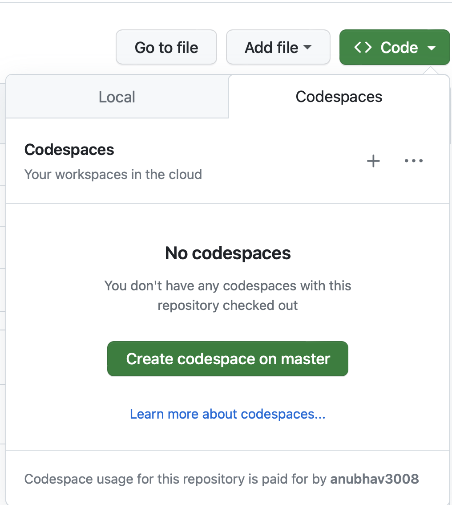

## Assignments
Please consider using github code spaces for better visual aid. 
Creating code space on master will open visual studio code on browser.

### Assignment # 1:  Hashcode and equals
#### Question: 
Consider two classes below: 
```java
public class Person {
    private final int age;
    private final String name;
    public Person(String name, int age) {
    this.name = name;
    this.age = age;
    }
}

public class Employee extends Person {
    private final String role;
    public Employee(String name, int age, String role) {
    super(name, age);
    this.role = role;
    }
}
```
The task is to write appropriate hashCode() and equals()methods for both classes.
Nothing from the above source should be modified but additional fields and methods can be
added. Instances of Person and Employee should never be equal to one another. An
Employee is equal to another Employee if the role, age, and name are all equal between
instances. A Person is equal to another Person instance if the age and name are both equal
between instances.

#### Solution: 
Checkout class

| Class name                                            | Unit tests                                                    | 
|-------------------------------------------------------|---------------------------------------------------------------|
| [Employee.java](src/main/java/problem1/Employee.java) | [EmployeeTest.java](src/test/java/problem1/EmployeeTest.java) | 
| [Person.java](src/main/java/problem1/Person.java)     | [PersonTest.java](src/test/java/problem1/PersonTest.java)     | 

<br>

**Explanation**:
The solution is straightforward by adding the neccesory checks in equals and hashcode. 


### Assignment # 2:  Statistics calculator
- The task here is to implement this interface. If you want to write  multiple implementations then that is good, or you can focus on writing just one. Some notes regarding implementations:
- Implementations of this class must be 'thread-safe'. The definition of the term 'thread-safe' is left up to you.
- Implementations may choose to prioritize (or not) various aspects of the performance and or behavior of their instances - this is acceptable as long as the compromise can be explained and justified.
- You are free to choose appropriate behavior for any corner cases but are expected to be able to justify those behaviors.
- If you want to optimize for ‘performance’ (whatever you take performance to mean) here at the expense of code readability then that is fine, but you’ll need to be able to explain the code to us.
- If something appears counterintuitive or overly complex then code comments can be useful.

```java
package statistics;
/**
* Tracks the statistics of a continual stream of values.
*/
public interface Statistic {
    /*
    * Called to update the statistic with a new sample value.
    */
    void event(int value);
    /*
    * Returns the mean of the received sample values.
    */
    float mean();
    /*
    * Returns the minimal received sample value.
    */
    int minimum();
    /*
     * Returns the maximal received sample value.
     */
    int maximum();
    /*
     * Returns an estimate of the variance of the total population
     * given the received sample values.
     */
    float variance();
}
```
#### Solution 
Checkout following class for solution: 
[SimpleStatistics.java](src/main/java/problem2/SimpleStatistics.java)
[SimpleStatisticsTest.java](src/test/java/problem2/SimpleStatisticsTest.java)

##### Approach
- Use Blocking queue to keep track of all the values considered for Stats. 
- The add operation will be O(1), with 1 or 2 ms being taken in taking the lock. 
- Other operations will be O(n).  

##### Test case:
- The testing is done using the class [SimpleStatisticsTest.java](src/test/java/problem2/SimpleStatisticsTest.java)
- Testing is done with concurrency level of 100, where we have 100 threads trying to update and read the data together.  
- Accuracy is kept paramount, and we assert at every step to make sure the values are correct.  

### Other useful information
**Testing framework**:  Junit  <br>
**Logging framework**:  log4j <br>
**dependency management**:  maven
